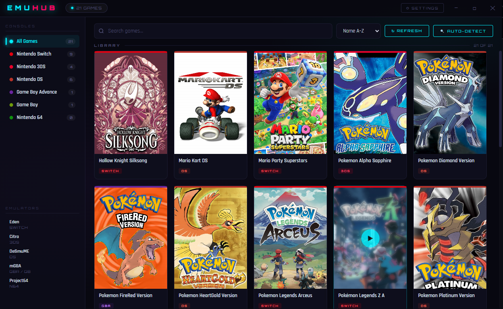
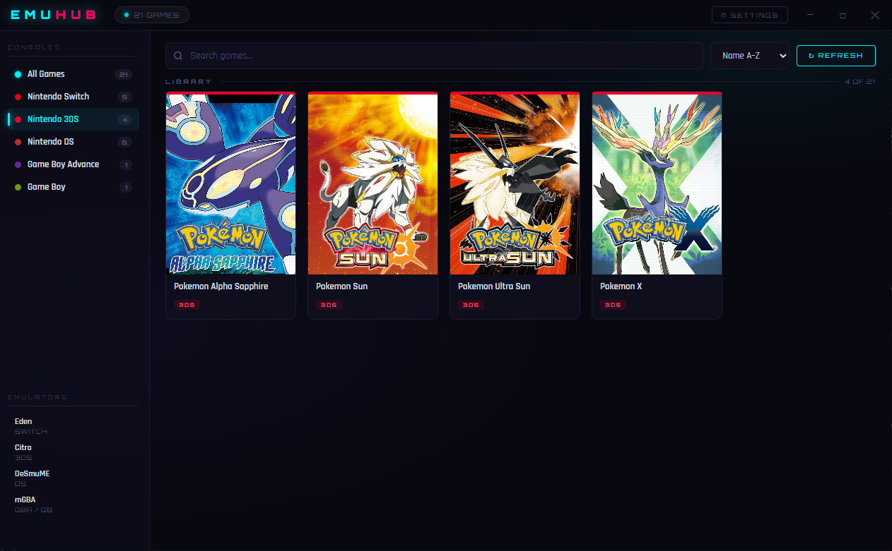
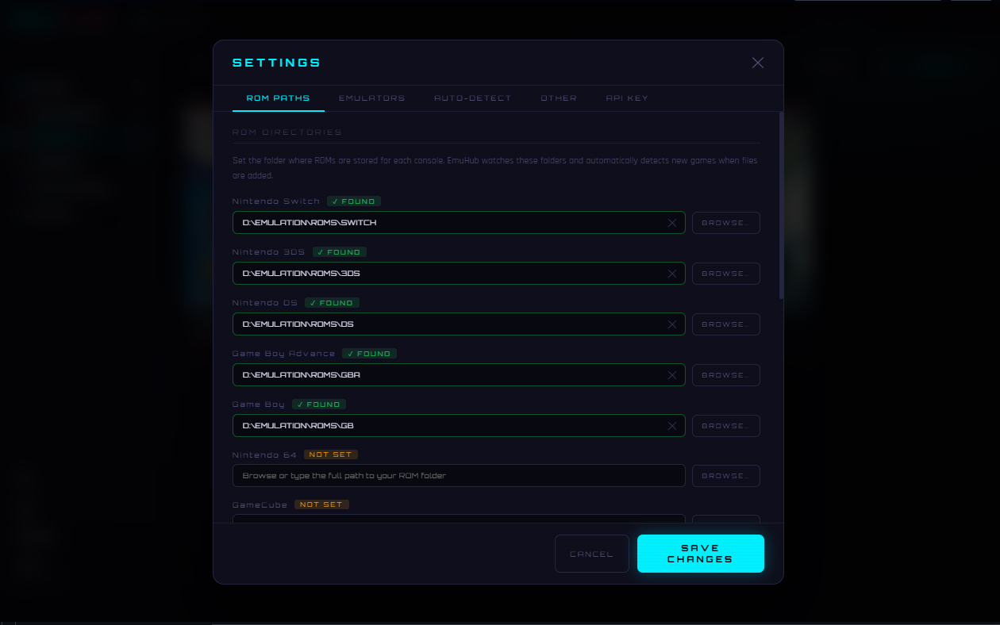

# EmuHub

> A unified launcher for all your emulators — one place to browse, organize, and launch your entire game library.



---

## What is EmuHub?

EmuHub is a single desktop application that brings every emulator you have into one clean interface. Browse your full game collection across all consoles, click a game, and it launches instantly in the correct emulator — no switching between programs, no digging through folders.

**Box art is fetched automatically** via SteamGridDB. Configure it once and every game in your library gets its cover art with no manual work.

---

## Screenshots

| Library | Filtered by Console | Settings |
|---|---|---|
|  |  |  |

---

## Supported Consoles & Emulators

| Console | Recommended Emulator | Supported File Types |
|---|---|---|
| Nintendo Switch | Eden / Ryujinx / Yuzu | `.nsp` `.xci` |
| Nintendo 3DS | Citra / Lime3DS / Azahar | `.3ds` `.cia` `.zip` |
| Nintendo DS | DeSmuME / melonDS | `.nds` `.zip` |
| Game Boy Advance | mGBA / VBA-M | `.gba` `.zip` |
| Game Boy / GBC | mGBA / VBA-M | `.gb` `.gbc` `.zip` |
| Nintendo 64 | Project64 / Mupen64Plus | `.z64` `.n64` `.v64` `.zip` |
| GameCube | Dolphin | `.iso` `.gcm` `.gcz` `.rvz` |
| Wii | Dolphin | `.iso` `.wbfs` `.gcz` `.rvz` `.wad` |
| NES | FCEUX / Nestopia / Mesen | `.nes` `.unf` `.zip` |
| SNES | Snes9x / bsnes / Mesen | `.sfc` `.smc` `.zip` |
| Sega Genesis | BlastEm / Gens | `.md` `.bin` `.gen` `.zip` |
| PlayStation | DuckStation / ePSXe | `.bin` `.cue` `.iso` `.chd` |
| PlayStation 2 | PCSX2 | `.iso` `.bin` `.chd` |
| PlayStation 3 | RPCS3 | `.pkg` `.iso` |
| PSP | PPSSPP | `.iso` `.cso` `.pbp` |
| Xbox 360 | Xenia / Xenia Canary | `.iso` `.xex` |

> **EmuHub does not include any emulators or ROMs.** You must install emulators separately and point EmuHub to them via Settings.

---

## System Requirements

- **OS:** Windows 10 (21H2 or later) or Windows 11
- **Runtime:** Microsoft Edge WebView2 (pre-installed on Windows 11; `BUILD.bat` installs it automatically on Windows 10)
- **To run the `.exe`:** Nothing else required — double-click and go
- **To build from source:** Python 3.10 or later (see below)
- **Box art:** Internet connection + free SteamGridDB account (optional)


---

## Getting Started

### Option A — Just run it (no Python needed)

1. Go to the [**Releases**](../../releases) page
2. Download `EmuHub.exe`
3. Double-click it — that's it

> If you see a WebView2 error, run `BUILD.bat` once or [install WebView2 manually](https://developer.microsoft.com/en-us/microsoft-edge/webview2/).

---

### Option B — Build from source

1. Install [Python 3.10+](https://www.python.org/downloads/) — check **"Add Python to PATH"** during setup
2. Clone or download this repository
3. Double-click **`BUILD.bat`**

`BUILD.bat` will automatically:
- Check for Python and guide you if it's missing
- Install the Visual C++ Redistributable if needed
- Install the WebView2 Runtime if needed
- Install Python dependencies (`pywebview`, `pyinstaller`)
- Compile everything into a single portable `dist\EmuHub.exe`

---

## First-Time Setup

When you launch EmuHub for the first time, a **guided onboarding wizard** walks you through three quick steps:

1. **Emulators** — Auto-detect installed emulators on your system or open Settings to manually browse to each `.exe`
2. **ROM Folders** — Open Settings to point each console at the folder where its ROMs are stored
3. **Cover Art (optional)** — Enter a free [SteamGridDB](https://www.steamgriddb.com) API key so EmuHub can automatically download box art for every game

After setup you'll see a quick feature overview — search, launch, filter by console, sort, and more.

The wizard only appears once. You can skip any step and configure everything later via **⚙ Settings**.

> You can also click the **AUTO-DETECT** button on the main toolbar at any time to scan for new emulators.

### Box art setup

1. Create a free account at [steamgriddb.com](https://www.steamgriddb.com)
2. Go to **Profile → Preferences → API → Generate API Key**
3. During the wizard (or later in **Settings → API KEY**), paste your key and click **SAVE**

Box art loads automatically for every game and is cached locally — it only downloads once.

---

## Custom / Unsupported Emulators

Use **Settings → OTHER** to add any emulator that isn't in EmuHub's built-in list:

- Set the emulator name, `.exe` path, ROM folder, and supported file extensions
- The emulator appears as a new console category in the sidebar
- EmuHub validates file types at launch — files with unsupported extensions are rejected

---

## Known Limitations

| Limitation | Detail |
|---|---|
| Windows only | EmuHub uses Windows-specific APIs (DPAPI, WebView2, Win32). macOS/Linux are not supported. |
| Emulators not included | You must install emulators separately. EmuHub is a launcher, not an emulator. |
| ROMs not included | You must supply your own ROM files. |
| Box art requires account | Automatic box art requires a free [SteamGridDB](https://www.steamgriddb.com) API key. |
| API key is user-bound | The SteamGridDB key is encrypted with Windows DPAPI and tied to your Windows user account. It cannot be transferred to another machine. |


---

## Project Structure

```
emuhub_py/
├── src/
│   ├── main.py          # Python backend — ROM scanning, emulator launching, API
│   └── web/
│       └── index.html   # Frontend UI (HTML/CSS/JS, rendered by pywebview)
├── assets/
│   └── icon.ico         # Application icon
├── BUILD.bat            # One-click build script
├── RUN_DEV.bat          # Run from source without building
├── EmuHub.spec          # PyInstaller build configuration
└── README.md
```

---

## Contributing

Pull requests are welcome. Areas where contributions are most useful:

- **New emulator signatures** — add entries to `EMU_SIGNATURES` in `main.py` for emulators not yet listed
- **New console support** — add to `CONSOLE_EXTS`, `DEFAULT_ROM_PATHS`, and `DEFAULT_EMULATORS`
- **Bug fixes** — open an issue first for anything significant
- **UI improvements** — the entire frontend lives in `src/web/index.html`

Please do **not** submit PRs that include ROM files, BIOS files, emulator executables, or decryption keys.

---

## Legal

EmuHub is a launcher frontend. It does not include, distribute, or endorse the acquisition of ROM files or copyrighted game data. Users are solely responsible for complying with the laws in their jurisdiction regarding game backups and emulation.

Box art is sourced via the [SteamGridDB API](https://www.steamgriddb.com) under their terms of service.

---

## License

MIT — see [LICENSE](LICENSE) for details.

---

<p align="center">
  Built with <a href="https://pywebview.flowrl.com/">pywebview</a> · Box art via <a href="https://www.steamgriddb.com">SteamGridDB</a>
</p>
